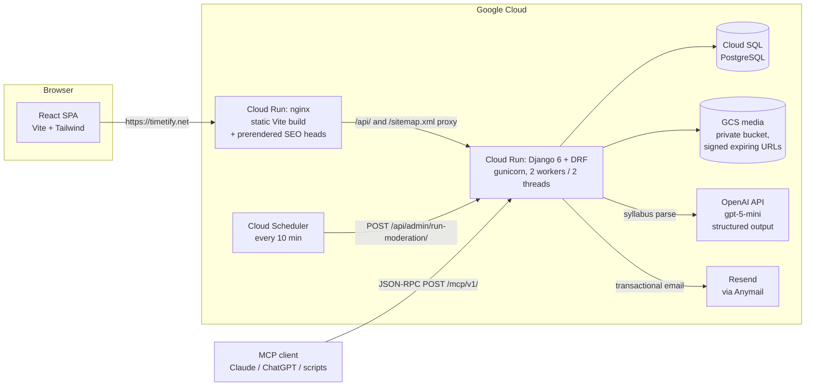

# Timetify

**Turn university syllabi into shared, colour-coded schedules.** Upload a PDF/DOCX syllabus, a schema-validated extraction pipeline reads out courses, exams and deadlines, and you see your friends' timetables side-by-side to find free time and coordinate study sessions.

## Demo

**[Live application](https://timetify.net)** — create an account with any email address and try the full flow: upload a syllabus, review what was extracted, add friends, compare schedules.

Demo videos (also on the [help page](https://timetify.net/help)):

- Uploading a syllabus and reviewing the extracted courses/exams/assignments — watch the **"How do I upload my course outline?"** section on the [help page](https://timetify.net/help) (~12 MB, too large to inline here).
- Creating a study event straight from a chat message:

https://github.com/Her304/timetify-gcp/raw/main/frontend/public/help/event-from-chat.mp4

## Features

- **One-click syllabus import** — upload a PDF or DOCX; courses, weekly topics, exams, assignments and labs are extracted into a review page where you confirm or fix everything before it hits your schedule
- **Your week at a glance** — colour-coded weekly schedule, desktop and mobile
- **Friends' schedules side-by-side** — shared classes, who's free when, availability lookups
- **Direct messages & snaps** — chat with classmates; photo snaps that disappear after 24 hours
- **Study events with RSVP + conflicts** — create events from a chat slash-command; conflicts with existing courses are detected
- **Smart notifications** — upcoming exams, assignments, new snaps and messages
- **Calendar export** — download any course schedule as an `.ics` file for Google/Apple Calendar
- **MCP agent bridge** — connect an AI agent (Claude, ChatGPT, any MCP client) to your own Timetify data over OAuth 2.1 or a personal access token

## Technical highlights

- **AI extraction with a hard validation boundary**: the model is forced into structured output against a Pydantic schema; typed `date` fields reject ranges and "TBD", ambiguous data comes back as labelled guesses rather than fabrications, and every result passes through a human review page before it is saved
- **Model choice backed by a bake-off**: native PDF understanding via the Files API scored 12/13 on a 13-syllabus test set vs 6/13 for text-extraction paths — the comparison scripts (`backend/compare_*.py`) are in the repo
- **Security-hardened authentication**: JWT with default-deny permissions, anti-enumeration login and password reset, spoof-resistant rate limiting keyed on proxy-verified client IPs, case-insensitive identity with database-level unique constraints
- **Post-pentest hardening**: dependency pins raised after an August 2026 penetration test; private GCS media bucket with IAM-signed expiring URLs; Django admin moved off `/admin/`
- **A real OAuth 2.1 authorization server** (PKCE, S256 only, dynamic client registration, RFC 8414/9728 discovery) powering the MCP endpoint — hand-rolled on plain Django/WSGI, no SDK
- **Two-service Cloud Run deployment**: nginx serving a prerendered Vite build + gunicorn/Django behind it, Cloud SQL Postgres, Cloud Scheduler moderation cron, Sentry on both sides

## Architecture



**Backend** (`backend/`): Django 6 + Django REST Framework. All API endpoints live under `/api/`, default-deny: `DEFAULT_PERMISSION_CLASSES = IsAuthenticated` — every public endpoint must opt in explicitly.

**Frontend** (`frontend/`): React + Vite + Tailwind. Route heads are prerendered at build time (`scripts/prerender.mjs`) so crawlers see real titles/descriptions without a server-side framework.

### Authentication & authorisation

| Surface | Mechanism |
|---|---|
| Humans (SPA) | JWT access/refresh tokens (SimpleJWT). Default-deny: unauthenticated requests get 401 on every endpoint that isn't an explicit opt-in (`register`, `login`, password reset, public pages). |
| AI agents (MCP) | OAuth 2.1 with PKCE (S256 only) or a personal access token; only a SHA-256 hash of the token is stored; writes require two-step confirmation; scope-limited to the authorising user's own data. |

Details worth calling out:

- **Anti-enumeration**: login returns one identical error for unknown-username and wrong-password; password reset returns the same response (and logs, rather than leaks) for unregistered addresses; the sign-up availability check is deliberately an existence oracle but is rate-limited so it can't be bulk-queried.
- **Spoof-resistant throttling**: rate-limit buckets key on the *rightmost* `X-Forwarded-For` entry (the one our proxy wrote), not the caller-supplied part — rotating a forged header can't mint fresh buckets. Login is throttled on two axes: per-IP and per-username.
- **Case-insensitive identity**: usernames and emails are unique case-insensitively, enforced both in serializers and by database constraints (closes the concurrent-signup race).
- **Isolation tested**: cross-user access to another user's courses is covered by the test suite.

### How the syllabus parser works (and how its output is validated)

The word "AI" here means exactly one thing: **an LLM is used as a constrained transcriber** that converts syllabus text into a typed, pre-defined JSON schema — it never writes to the database directly.

1. **Extraction** — the PDF is sent to OpenAI `gpt-5-mini` via the Files API with a `response_format` pinned to a Pydantic model (`ExtractedCoursesResponse`). Alternative provider (Spur/GLM) available via `COURSE_PARSER_PROVIDER` for cost independence.
2. **Schema validation at the boundary** — every field is typed: `date` fields reject `"2026-07-31 to 2026-08-14"`, `"TBD"`, and `"June 15"` outright; the whole response is validated before anything downstream sees it. A refusal or unparseable output surfaces as an explicit error, never as silently empty data.
3. **Nulls over fabrication** — the prompt forces honest nulls for anything the syllabus doesn't state (no invented classrooms, times or dates). When a date is genuinely ambiguous (e.g. a registrar-set exam *window*), the model may attach a **labelled guess** (`suggested_date` + `suggestion_basis`), kept in a separate field so a guess can never pass for a stated date.
4. **Human review page** — the student confirms, corrects or discards every extracted item before it is saved. Accepted guesses are flagged as estimates and deliberately **excluded from calendar exports**.
5. **Second pass for relative dates** — week-relative deadlines ("due week 5") are impossible to resolve until the student confirms a term start date; once they do, a refine pass re-runs with those dates as ground truth.

Failure paths are handled explicitly (and tested): unsupported file types, empty extractions, provider outages, schema mismatches and model refusals each return a specific error rather than a crash. `backend/main/tests/test_parser_schema.py` pins all of this down offline — no API key needed.

## Engineering decisions

- **Native PDF understanding over text extraction.** A 3-model, 2-path bake-off on 13 real syllabi: Files-API PDF input scored 12/13; pdfplumber-text paths 6/13 and 0/13. Numbers are reproducible from the committed scripts.
- **Two small Cloud Run services instead of one.** The frontend is a static nginx image (fast deploys, cheap, prerendered heads); the backend scales independently. The nginx config is envsubst-rendered, and it 301s raw `*.run.app` hostnames to the canonical domain so staging URLs never leak into search results.
- **Private GCS bucket + IAM `signBlob` URLs.** After the pentest flagged the public media bucket, media moved behind signed expiring URLs — which required working around django-storages' local-key signing on Cloud Run (it signs through the IAM API instead).
- **Per-endpoint throttling, not blanket.** The app polls (feed, unread counts) so a global rate limit would fire on normal use; only the endpoints an attacker would hammer are limited.
- **Stateless JSON-RPC MCP, no SSE.** Prod runs 4 concurrent requests; a long-lived stream per agent would starve the app, so the server is a single stateless `POST /mcp/v1/` endpoint.
- **Shared cache for throttle counters.** Counters must be shared across Cloud Run instances — Redis when configured, a database cache table otherwise. A per-process cache would make every limit advisory.

## Testing

```bash
cd backend
DEBUG=True BACK_SENTRY_DSN= python manage.py test main.tests --settings=backend.test_settings
```

38 tests covering: the parser's validation boundary (range/TBD rejection, nulls vs labelled guesses, recurring items, provider failure paths), authentication (registration, case-insensitive login, JWT access control, cross-user isolation), the anti-enumeration password-reset flow, and throttling (limits firing, X-Forwarded-For spoof resistance). The suite runs offline against in-memory SQLite — no API keys, no Postgres, no email.

CI (`.github/workflows/ci.yml`) runs the backend suite and a frontend production build on every push and PR.

## Local development

```bash
# Backend (Django 6, Python 3.12)
cd backend
python3 -m venv .venv && source .venv/bin/activate
pip install -r requirements.txt
```

Create `.env` at the repo root:

```
DEBUG=True
OPENAI_API_KEY=sk-...        # only needed for syllabus parsing
# Optional — transactional email (Resend):
Resend_API_KEY=re_...
```

The app expects a PostgreSQL on `127.0.0.1:5432` (override with `DB_*` env vars, or `INSTANCE_CONNECTION_NAME` for Cloud SQL). Then:

```bash
python manage.py migrate
python manage.py runserver
```

```bash
# Frontend (React + Vite)
cd frontend
npm install
npm run dev      # http://localhost:5173
```

## Limitations and future work

- **Document coverage**: parsing accepts PDF/DOCX only — no OCR for photographed syllabi. Extraction quality depends on the syllabus layout; the nulls-not-fabrications rule means sparse syllabus → sparse (honest) extraction.
- **No calendar sync yet**: one-way `.ics` export exists; Google/Apple two-way sync is on the roadmap.
- **Group chats**: direct messages only today; group chats and study spaces are on the roadmap.
- **Test coverage is backend-core only**: the MCP/OAuth layer and the whole frontend are not yet covered by automated tests, and the frontend linter currently reports ~24 pre-existing errors. Both are next up.
- **Single-region, single-language**: deployed in `us-central1`, English-only documents and UI.
- **Moderation is heuristic + cron**: the pipeline runs every 10 minutes via Cloud Scheduler, not in real time.

## License

Educational use. Built by students, for students.
